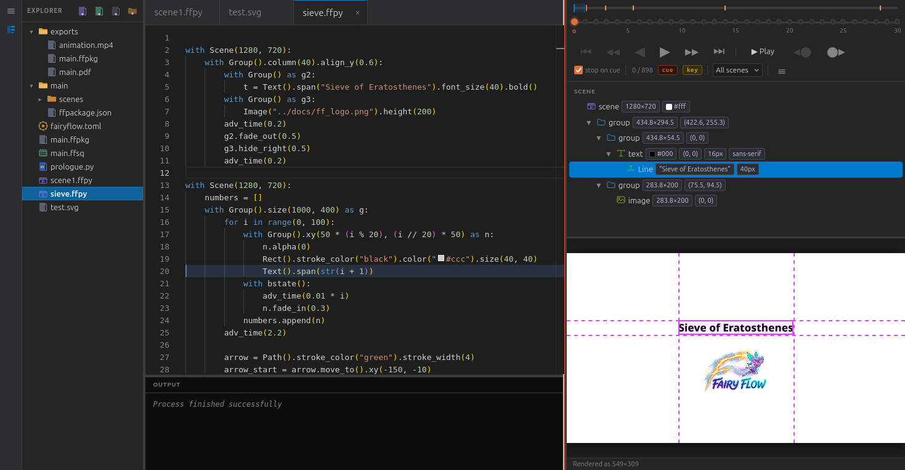

# FairyFlow — animated slides & animations in Python

<p align="center">
  
</p>

<p align="center">
  <a href="https://spirali.github.io/fairyflow/">Documentation</a> ·
  <a href="https://spirali.github.io/fairyflow/getstarted/">Get started</a> ·
  <a href="https://spirali.github.io/fairyflow/examples/">Examples</a>
</p>

---

**FairyFlow** is a Python-driven tool for creating animated slides and general-purpose animations. You write plain Python, and FairyFlow evaluates it live in an interactive environment that keeps your code, scene tree, and rendered result in sync.

<p align="center">
  
</p>

## Key features

- **Python-first authoring** — animations are plain `.py` scripts; no DSL to learn
- **Live interactive environment** — edit code, press Ctrl+Enter, see the result instantly
- **Vector scene graph** — scenes are stored as vector graphics and rasterized at the last moment, so any output resolution is lossless
- **Presentation cues** — `cue()` pauses the player for click-to-advance presentations
- **Multiple export formats** — standalone `.ffpkg` player package, MP4 video, and multi-page PDF

## Documentation

**<https://spirali.github.io/fairyflow/>**


## Quick start

```bash
pip install fairyflow

fairyflow init my_project
fairyflow open my_project
```

`fairyflow open` starts a local web server and prints the URL to the interactive studio. Open `scenes/scene1.ffpy` in the editor, write some code, and press Ctrl+Enter to evaluate:

```python
with Scene():
    stext("Hello world!").fade_out()
```

## Project layout

```
my_project/
├── fairyflow.toml       ← project settings (fps, prologue path)
├── prologue.py          ← shared imports and defaults for all scenes
├── scenes/
│   └── scene1.ffpy      ← animation code
└── sequences/
    └── sequence1.ffsq   ← ordered playlist of scenes for export
```

## Export formats

| Format | Command / UI |
|---|---|
| Player package (`.ffpkg`) | Export → Player package in the studio |
| Video (`.mp4`) | Export → Video (requires ffmpeg) |
| PDF | Export → PDF |

Play a package with:

```bash
fairyflow play mypackage.ffpkg
```

## License

MIT — see [LICENSE](LICENSE).
