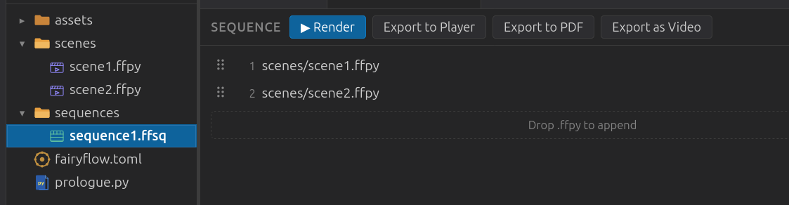

# Exports

FairyFlow can export your sequences in three formats. All export options are available in the sequence editor. Sequence editor is opened when `.ffsq` file is opened. 



| Format | Use case |
|---|---|
| **Player package** (`.ffpkg`) | Interactive playback with cue-based navigation |
| **Video** (`.mp4`) | Sharing or embedding; requires ffmpeg |
| **PDF** | Slide handouts; each selected frame becomes one page |

---

## Player package

A `.ffpkg` is FairyFlow's native self-contained format. It bundles the animation data so it can be played without a running server.

Play a package with:

```
fairyflow play <mypackage.ffpkg>
```

Pass `--twin-view` to open two windows instead of one — a clean window (for a
projector) and a presenter window with [speaker notes](cues.md#speaker-notes) on by
default:

```
fairyflow play <mypackage.ffpkg> --twin-view
```

**Keyboard shortcuts in the player:**

| Key | Action |
|---|---|
| ++right++ or ++page-down++ | Continue to next cue / advance animation |
| ++left++ or ++page-up++ | Step back |
| ++home++ | Jump to first frame |
| ++end++ | Jump to last frame |
| ++f5++ | Toggle fullscreen |
| ++n++ | Toggle the speaker-notes overlay for the focused window |

The player automatically pauses at every [cue](cues.md), and at the end of every scene,
unless the scene uses `flow=True`.