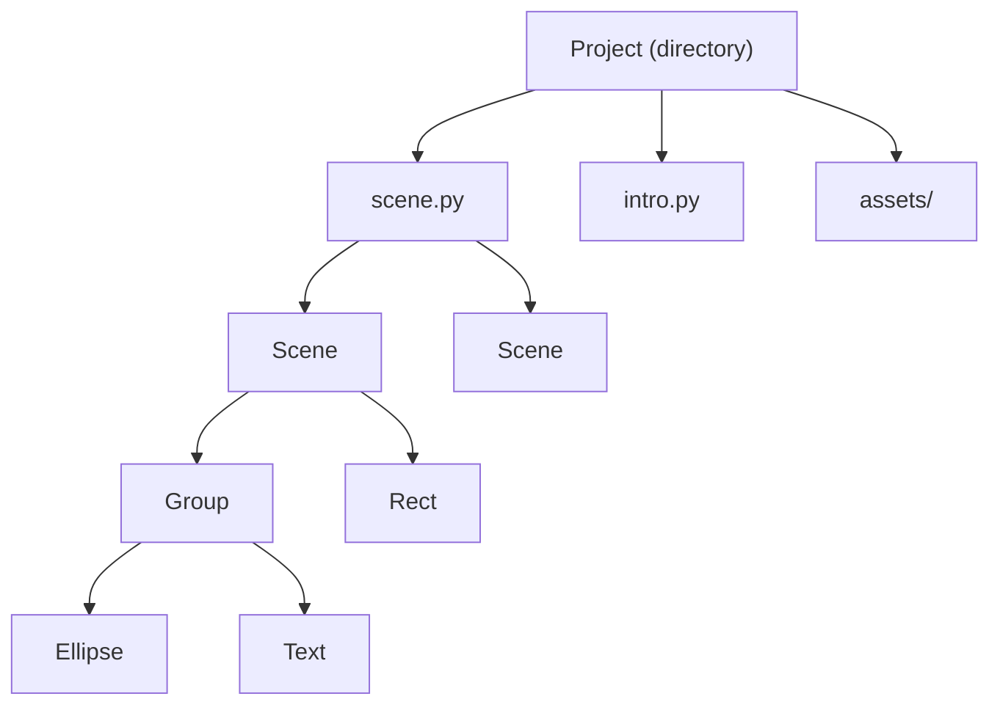

# Project Structure

## Concepts

FairyFlow animations are built around three layers: the **project**, the **scene file**, and the **scene**.



### Scene

A `Scene` is the top-level canvas. It defines the canvas dimensions and background color. Everything visible in an animation belongs to a scene.

```python
with Scene(width=400, height=300, color="white"):
    ...
```

The default scene size is **300 × 200** pixels.

### Group

A `Group` is a container node. It has its own coordinate system, optional layout (column/row), and an animatable clipping window. Children are positioned relative to the group's origin.

```python
with Scene():
    with Group().size(200, 120).xy(50, 40):
        Rect().size(60, 60).color("steelblue").xy(10, 30)
        Ellipse().size(60, 60).color("coral").xy(130, 30)
```

### Nodes

Leaf nodes are the building blocks of a scene:

| Node | Description |
|---|---|
| `Rect` | Rectangle with fill and optional stroke |
| `Ellipse` | Ellipse or circle |
| `Path` | Arbitrary vector path (lines, cubic curves) |
| `Text` | Multi-span text block |
| `Image` | Raster image (PNG, JPEG, SVG, ORA) |

All nodes support animatable position, alpha, and z-ordering. Shape nodes also support color and stroke. See the individual pages for details.

## Project layout

A project created with `fairyflow init` looks like:

```
my_project/
├── fairyflow.toml       ← project settings (fps, prologue path)
├── prologue.py          ← shared imports and defaults for all scenes
├── scenes/
│   └── scene1.ffpy      ← animation code (add more .ffpy files as needed)
├── sequences/
│   └── sequence1.ffsq   ← sequence definition (ordered playlist of scenes)
└── assets/              ← images and other resources
```

**`fairyflow.toml`** configures the project frame rate and the path to the prologue file.

**`prologue.py`** is automatically prepended to every scene file before evaluation. Use it for shared imports and default scene settings via `set_default_scene`.

Each `.ffpy` file in `scenes/` is a **scene file** — a Python script that creates `Scene` objects via `with Scene():` blocks. Multiple scenes in one file are rendered as separate animations.

A **sequence** (`.ffsq`) is a JSON file that collects scene files into an ordered playlist.
